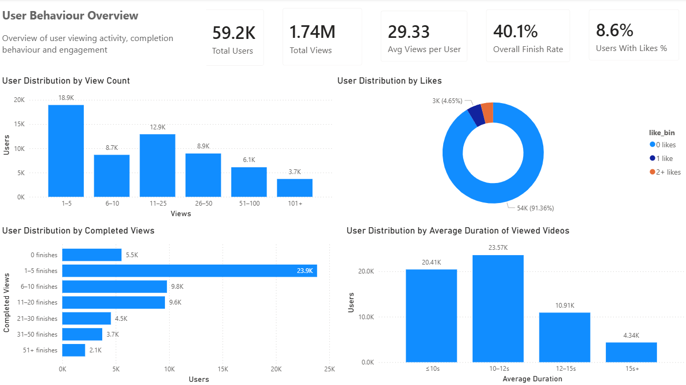
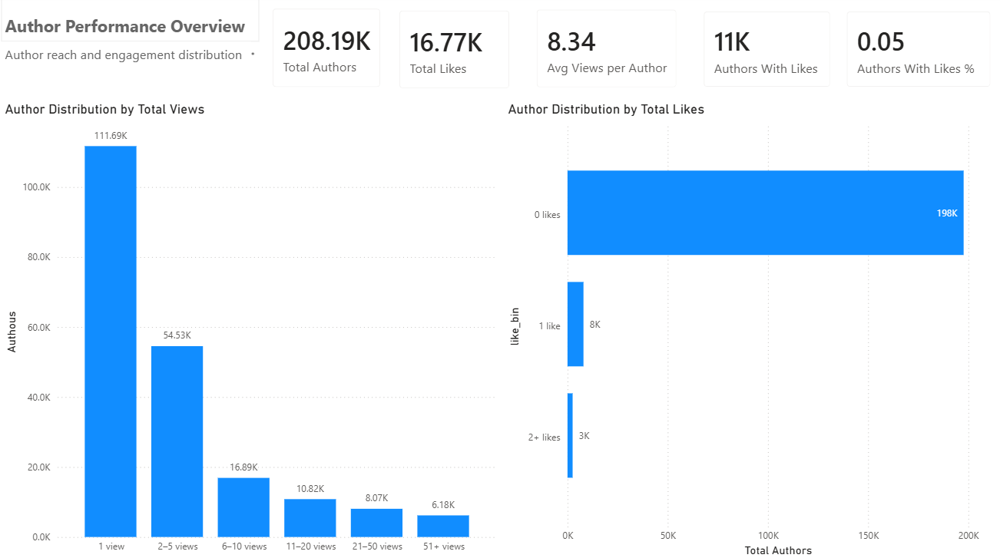
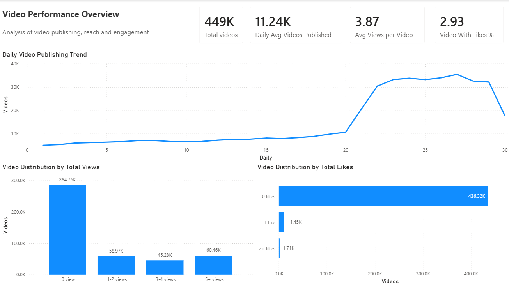

# TikTok / Douyin User, Creator & Video Performance Analysis

## Project Overview

This project analyses a large-scale Douyin/TikTok-style behavioural dataset to understand how users consume video content, how reach and engagement are distributed across creators and videos, and how publishing activity changes over time.

The project uses **Python and Pandas for data preparation**, followed by **Power BI for interactive dashboard development and visual analysis**.

The analysis is structured around three perspectives:

* **User behaviour** — how users consume and interact with content
* **Author performance** — how views and likes are distributed across creators
* **Video performance** — how individual videos perform in terms of reach, engagement, and publishing activity

---

## Business Questions

This project aims to answer the following questions:

1. How actively do users consume video content?
2. How common are likes and completed views among users?
3. What type of video content dominates the observed viewing mix?
4. How unevenly are views distributed across creators?
5. How common is engagement across creators and videos?
6. How does video publishing activity change over time?
7. How unevenly are views and likes distributed across authors and videos?

---

## Tools & Technologies

* Python
* Pandas
* NumPy
* JupyterLab
* Power BI
* DAX
* Git / GitHub

---

## Project Workflow

```text
Raw Douyin Dataset
        ↓
Data Cleaning & Validation
        ↓
Feature Engineering
        ↓
User / Author / Video Feature Tables
        ↓
Power BI-ready Data
        ↓
Power BI Dashboards
        ↓
Insights & Interpretation
```

---

## Repository Structure

```text
tiktok-data-analysis/
│
├── notebooks/
│   ├── 00_data_preparation.ipynb
│   ├── 01_user_features.ipynb
│   ├── 02_author_features.ipynb
│   └── 03_video_features.ipynb
│
├── powerbi/
│   └── tiktok_data_analysis.pbix
│
├── images/
│   ├── user_dashboard.png
│   ├── author_dashboard.png
│   └── video_dashboard.png
│
├── README.md
└── .gitignore
```
---

# Dataset

The raw dataset is not included directly in this repository because of GitHub file-size restrictions.

**Dataset:** [Download from Google Drive](https://drive.google.com/file/d/1swIVDzHIKYNoUaARUVn6yl1gdvhdUXED/view?usp=sharing)

After downloading the dataset, create the following folder structure inside the project:

```text
data/
└── raw/
    └── douyin_dataset.csv
```

The expected dataset path is:

```text
data/raw/douyin_dataset.csv
```

The notebooks generate the processed User, Author, and Video feature tables from this raw dataset.

---

# Data Preparation

The raw behavioural dataset contains information related to:

* Users
* Videos
* Authors
* Music
* Cities
* Video duration
* Likes
* Completed views
* Publishing information

The first notebook performs the core data preparation process, including:

* Schema validation
* Missing-value checks
* Duplicate checks
* Data type validation
* Removal of unnecessary index columns
* Aggregation into user-, author-, and video-level feature tables
* Validation of total views and likes across analytical levels

---

# Analytical Data Grains

The project deliberately creates three separate analytical tables.

## User Level

Each row represents one user.

This table is designed to answer:

> **How do users consume and interact with content?**

Key features include:

* Total views
* Like count
* Completed-view count
* Completion rate
* Like rate
* Average duration of videos viewed by each user
* Behavioural distribution groups

---

## Author Level

Each row represents one content creator.

This table is designed to answer:

> **How are reach and engagement distributed across creators?**

Key features include:

* Total views received
* Total likes received
* Completed views
* Number of unique videos
* Views per video
* Like rate
* Completion rate
* View distribution groups
* Like distribution groups

---

## Video Level

Each row represents one unique video.

This table is designed to answer:

> **How does individual content perform and how does publishing activity change over time?**

Key features include:

* Video ID
* City
* Music ID
* Publishing date
* Total views
* Like count
* Like rate
* Engagement indicator
* View distribution group
* Like distribution group

Publishing-date features are also created for time-series analysis in Power BI.

---

# Power BI Dashboards

The final Power BI report contains three analytical dashboards.

## 1. User Behaviour Dashboard

The User dashboard focuses on how users consume and interact with video content.

Key metrics and visuals include:

* Total users
* Average views per user
* Completion behaviour
* Like activity
* Viewing-frequency distribution
* Completed-view distribution
* User distribution by average duration of viewed videos

### Main Question

> How do users consume and engage with content?



---

## 2. Author Performance Dashboard

The Author dashboard focuses on creator reach and engagement.

Key metrics and visuals include:

* Total authors
* Average views per author
* Median views per author
* Percentage of authors receiving likes
* Author view distribution
* Author like distribution

### Main Question

> How unevenly are traffic and engagement distributed across creators?



---

## 3. Video Performance Dashboard

The Video dashboard focuses on content performance and publishing behaviour.

Key metrics and visuals include:

* Total videos
* Average videos published per active day
* Average views per video
* Percentage of videos receiving at least one like
* Daily video publishing trend
* Video view distribution
* Video like distribution

### Main Question

> How is content performance distributed across videos, and how does publishing activity change over time?



---

# Key Findings

## 1. Short-duration videos dominated the observed viewing mix

Around **74% of users had an average viewed-video duration of approximately 12 seconds or less**.

This indicates that relatively short videos represented a large share of the content observed in user viewing behaviour.

However, video duration should not be interpreted as actual watch time.

A user may watch only part of a longer video before moving to the next video.

Therefore, this finding describes the characteristics of the videos users were exposed to rather than the exact amount of time users spent watching them.

---

## 2. Completed viewing activity was limited for many users

More than half of users recorded **five or fewer completed views**.

This suggests that while viewing activity was common, repeated full-video completion was less common across the broader user population.

---

## 3. Explicit engagement through likes was uncommon

More than **90% of users recorded no like activity**.

This indicates that viewing behaviour was substantially more common than explicit interaction through likes.

The dataset therefore shows a distinction between:

* Content consumption
* Explicit engagement

---

## 4. Creator reach was highly uneven

Creator-level views showed a strongly right-skewed distribution.

Approximately:

* **53.65% of authors received only one recorded view**
* **79.84% received five views or fewer**
* Only **2.97% received more than 50 views**

This indicates that creator exposure was distributed very unevenly across the dataset.

---

## 5. Video-level engagement was extremely sparse

The video-level dataset contains approximately **449,000 videos**.

Like distribution was highly uneven:

* **97.07% of videos received no likes**
* **2.55% received exactly one like**
* Only **0.38% received two or more likes**

The dataset recorded **16,773 total likes**, but those likes were generated by only a small minority of videos.

This indicates that explicit video engagement was highly uneven across the content observed in the dataset.

---

# Overall Interpretation

The analysis suggests that viewing activity was substantially more common than explicit engagement through likes.

Short-duration videos represented a large share of the observed viewing mix, while creator reach and video-level engagement were distributed very unevenly.

Most creators received only a small number of recorded views, and the large majority of videos received no likes.

From a product perspective, these patterns could motivate further investigation into:

* Recommendation-system performance
* Creator discovery
* Content characteristics associated with higher engagement
* Converting passive viewing into explicit engagement
* Early-stage exposure for newly published videos

These findings should not be interpreted as evidence that low-view or low-like content is necessarily low quality.

Low engagement may also reflect limited exposure, recommendation behaviour, sampling effects, or the observation period.

---

# Data Validation

Consistency checks were performed during feature engineering to ensure that aggregation did not change the underlying interaction totals.

For example:

```text
Raw dataset total likes
=
Author feature table total likes
=
Video feature table total likes
```

The raw dataset and video-level feature table both recorded:

```text
16,773 total likes
```

Similar checks were performed for views and table grain.

---

# How to Run the Project

## 1. Clone or Download the Repository

Download or clone the repository to your local machine.

---

## 2. Download the Dataset

Download the raw CSV from:

**[Google Drive Dataset](https://drive.google.com/file/d/1swIVDzHIKYNoUaARUVn6yl1gdvhdUXED/view?usp=sharing)**

Create the following directory:

```text
data/raw/
```

and place the downloaded file there as:

```text
data/raw/douyin_dataset.csv
```

---

## 3. Run the Notebooks

Run the notebooks in the following order:

```text
1. 00_data_preparation.ipynb
2. 01_user_features.ipynb
3. 02_author_features.ipynb
4. 03_video_features.ipynb
```

`00_data_preparation.ipynb` performs data validation and creates the base User, Author, and Video feature tables.

The remaining notebooks perform additional feature engineering and prepare the final datasets used in Power BI.

---

## 4. Open the Power BI Report

Open:

```text
powerbi/tiktok_data_analysis.pbix
```

to explore the interactive dashboards.

If Power BI cannot locate the generated CSV files after the project is moved to another computer, update the data-source paths through Power Query before refreshing the report.

---

# Skills Demonstrated

This project demonstrates practical Data Analyst skills including:

* Data cleaning
* Data validation
* Feature engineering
* Aggregation across different analytical grains
* Exploratory data analysis
* Distribution analysis
* KPI design
* DAX measure creation
* Power BI dashboard development
* Time-series visualisation
* Business interpretation
* Communicating analytical limitations
* Reproducible project organisation

---

# Limitations

This analysis is based on the available behavioural dataset and should not be interpreted as a complete representation of the entire TikTok or Douyin platform.

Important limitations include:

* Recorded views represent observations within the dataset
* Video duration represents the video's total length, not actual user watch time
* Low like counts may be influenced by limited exposure
* Users, authors, and videos are subject to the original sampling methodology
* The analysis is descriptive rather than causal
* Platform recommendation logic is not available in the dataset

---

## Author

Data Analytics Portfolio Project

Built with **Python, Pandas and Power BI**.
